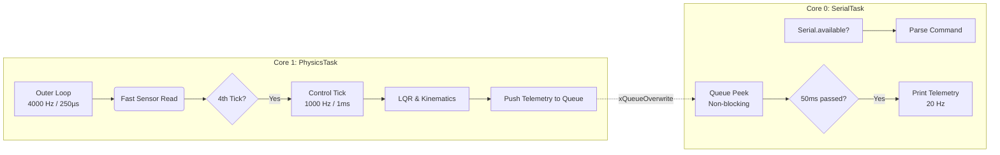
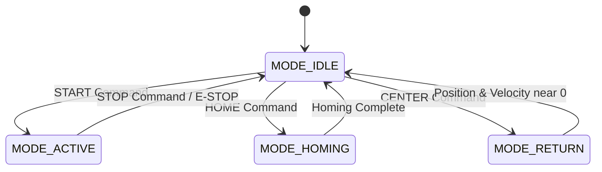
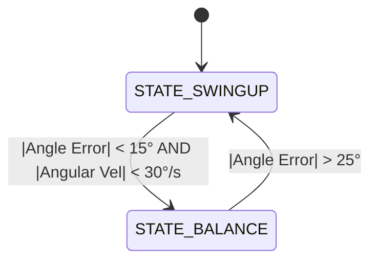

# Inverted Double Pendulum - Project Documentation

## Table of Contents
- [Introduction](#introduction)
- [Theory of Operation](#theory-of-operation)
  - [Cart-Pole State Space & LQR Control](#cart-pole-state-space--lqr-control)
  - [Phase-Lead Swing-Up Algorithm](#phase-lead-swing-up-algorithm)
- [Problem Description](#problem-description)
- [Software Architecture](#software-architecture)
- [Pinout Tables](#pinout-tables)
- [Timing Diagrams & FreeRTOS Architecture](#timing-diagrams--freertos-architecture)
- [State Machines](#state-machines)
- [Serial Command Reference](#serial-command-reference)
- [Python API Interfacing Guide](#python-api-interfacing-guide)

## Introduction

The Inverted Double Pendulum is a classic, highly non-linear control systems problem that serves as an excellent testbed for advanced modern control theory, embedded real-time processing, and precision mechatronics. This project implements a motorized cart running on a linear rail to dynamically balance a pendulum in its upright, inverted position. 

At its core, this project demonstrates the capability of an ESP32 microcontroller to handle hard real-time physics calculations using FreeRTOS, high-frequency sensor fusion, and multi-threaded processing. The system leverages state-feedback control (LQR) and an Integrator to maintain balance, while using a non-linear energy-pumping algorithm to "swing up" the pendulum from its resting downward state into the catch boundary.

---

## Theory of Operation

### Cart-Pole State Space & LQR Control

The system functions essentially like balancing a broomstick on the palm of your hand, where the motorized cart acts as your hand and the pendulum as the broom. The core goal is to stabilize an extremely unstable equilibrium point.

To control the system, we first define its mathematical state. The dynamics of the cart-pole can be fully described by four dynamic **State Variables** at any given time:

1. **Cart Position ($x$)**: The absolute position of the cart on the linear rail (meters).
2. **Cart Velocity ($v$)**: The speed of the cart (m/s).
3. **Pendulum Angle ($\theta$)**: The deviation of the pendulum from vertical center (radians).
4. **Pendulum Angular Velocity ($\omega$)**: The speed at which the pendulum is falling (rad/s).

We define the state vector $X$:

$$
X = \begin{bmatrix} x \\ v \\ \theta \\ \omega \end{bmatrix}
$$

Near the upright equilibrium point ($\theta \approx 0$), the highly non-linear equations of motion can be linearized into a standard state-space form:

$$
\dot{X} = A X + B u
$$

Where $A$ is the system dynamics matrix, $B$ is the input matrix, and $u$ is our control input (motor PWM).

**Linear Quadratic Regulator (LQR)**

The Linear Quadratic Regulator is an optimal control strategy. It calculates the optimal control input $u$ that minimizes a quadratic cost function $J$:

$$
J = \int_{0}^{\infty} (X^T Q X + u^T R u) dt
$$

- **$Q$ matrix**: Penalizes state errors (e.g., if we want to heavily penalize the pendulum angle falling, we increase the weight inside $Q$ for the $\theta$ state).
- **$R$ matrix**: Penalizes control effort (e.g., if we want to save power or prevent the motors from saturating, we increase the penalty in $R$).

By solving the Algebraic Riccati Equation offline, LQR provides an optimal feedback gain matrix $K = [K_x, K_v, K_\theta, K_\omega]$. In the embedded system, the control law becomes a simple weighted sum. When the pendulum is near vertical, the LQR algorithm multiplies each of these four state variables by specific gains (`Kth`, `Kw`, `Kx`, `Kv`) and sums them to determine the exact motor voltage (PWM) needed to counter the fall:

$$
u = -K X = -(K_x x + K_v v + K_\theta \theta + K_\omega \omega)
$$

**Adding an Integrator**

A pure LQR controller can suffer from steady-state error (e.g., drift) due to friction, unmodeled dynamics, or an unlevel rail. To fix this, an Integrator state is added to the system, accumulating position error over time to force the cart exactly back to the center of the rail.

**Implementation in the ESP32 Codebase**

In the ESP32 firmware, the physical state variables are continuously updated using the motor encoders and the SPI magnetic angle sensor. During the `STATE_BALANCE` mode, the LQR algorithm is applied directly. Here is the exact code snippet demonstrating the LQR feedback loop and the integrator:

```cpp
else if (sysState.pen_state == STATE_BALANCE) {
  // THE INTEGRATOR: Accumulate cart position error over time
  x_integral += (x * Config::Hardware::DT);
  x_integral = constrain(x_integral, -Config::LQR::IntLimit, Config::LQR::IntLimit);

  // 1. Calculate individual LQR feedback terms (u = -KX)
  debug_term_theta = Config::LQR::Kth * theta;
  debug_term_w = Config::LQR::Kw * w;
  
  // To move the cart towards the center, we must first lean the stick towards the center.
  // To lean the stick towards the center, we must accelerate the cart AWAY from the center.
  // Therefore, Kx, Kv, and IntK must have the OPPOSITE sign of Kth and Kw!
  debug_term_x = -Config::LQR::Kx * x;
  debug_term_v = -Config::LQR::Kv * v;
  debug_term_integral = -Config::LQR::IntK * x_integral;

  // 2. Sum for total control output
  debug_control = debug_term_theta 
                  + debug_term_w 
                  + debug_term_x 
                  + debug_term_v
                  + debug_term_integral;
```

### Phase-Lead Swing-Up Algorithm

LQR is only effective near the equilibrium point. If the pendulum is resting straight down, the system enters a **Swing-Up Phase** utilizing an advanced **Phase-Lead Energy Pump Algorithm**:

- **Zero-Crossing Detection**: The system tracks the maximum peak angle of each consecutive swing.
- **Phase-Lead Pumping**: By projecting the angle slightly into the future using its angular velocity, the cart reverses direction just *before* the pendulum crosses the center. This maximizes kinetic energy transfer.
- **Proportional Ramp-Down**: As the peak swing approaches the top (e.g., past 120°), the pump strength is linearly scaled down. This prevents the pendulum from violently overshooting the Catch Zone.

Once the pendulum enters the "Catch Zone" (e.g., within 15° of vertical), the LQR balancer seamlessly takes over to catch and stabilize it.

---

## Problem Description

The fundamental control objective is twofold:
1. **Swing-Up Phase**: Inject kinetic energy into the resting pendulum by moving the cart back and forth until the link reaches a critical angular threshold (within 15° of vertical).
2. **Balancing Phase**: Catch and stabilize the highly unstable upright equilibrium point using a multi-state feedback loop while keeping the cart centered on the rail.

This requires maintaining four critical state variables dynamically:
- Cart Position ($x$) and Velocity ($v$)
- Pendulum Angle ($\theta$) and Angular Velocity ($\omega$)

Key engineering challenges solved within this codebase include:
- **Real-Time Constraints**: Executing a deterministic 1000 Hz control loop and 4000 Hz sensor read loop using FreeRTOS pinned tasks.
- **Hardware Imperfections**: Overcoming static motor friction (stiction), compensating for back-EMF, and smoothing sensor noise using wrap-safe finite difference derivatives.
- **Safety Constraints**: Implementing soft rail limits (e.g., stopping the cart if it travels beyond $\pm0.4$m) and hardware limit switch homing.

---

## Software Architecture

The latest codebase revision has dramatically improved the software architecture for maintainability and scaling:
- **`Config.h` / `Config.cpp`**: All hardware pinouts, kinematic constraints, default LQR gains, and state machine tuning parameters have been centralized into a `Config::` namespace. This eliminates "magic numbers" in the main sketch.
- **`SystemState` Object**: Global runtime variables (like the current operating mode, test triggers, and offsets) have been cleanly encapsulated inside a centralized `sysState` object.

---

## Pinout Tables

### Communication Buses

| Bus / Interface | Signal | GPIO Pin | Notes |
|-----------------|--------|----------|-------|
| **I2C (MT6701)** | SDA | 13 | |
| | SCL | 12 | |
| **SPI** | MOSI | 10 | Shared by MT6816 & ICM45686 |
| | MISO | 8 | |
| | SCK | 11 | |
| | CS (MT6816) | 9 | Angle Sensor |
| | CS (ICM45686)| -1 | Disabled in code |

### Motor Control (BTS7960)

| Signal | GPIO Pin | Notes |
|--------|----------|-------|
| RPWM (Forward) | 2 | LEDC Channel 0 |
| LPWM (Reverse) | 3 | LEDC Channel 1 |
| R_EN | -1 | Wired HIGH by default |
| L_EN | -1 | Wired HIGH by default |
| R_IS | -1 | Current sense not connected |
| L_IS | -1 | Current sense not connected |

### Encoders & I/O

| Signal | GPIO Pin | Notes |
|--------|----------|-------|
| Motor Encoder A | 5 | PCNT_UNIT_0 |
| Motor Encoder B | 6 | PCNT_UNIT_0 |
| Home Switch | 15 | Active LOW (INPUT_PULLUP) |

---

## Timing Diagrams & FreeRTOS Architecture

The system utilizes ESP32's dual-core architecture, with tasks split between Core 0 and Core 1.



> [!NOTE] 
> **Core 1 (`PhysicsTask`)**: Hard real-time control loop. 
> - **4000 Hz Outer Loop (250 µs)**: Fast sensor reading and angle accumulation.
> - **1000 Hz Control Tick (1000 µs)**: Runs every 4th outer loop tick. Computes state tracking, error filtering, LQR control, and PWM output, then pushes telemetry to a FreeRTOS queue.
>
> **Core 0 (`SerialTask`)**: 
> - Non-blocking queue reads for telemetry.
> - Serial telemetry print interval is 50 ms.
> - Asynchronous serial command parsing.

---

## State Machines

The logic consists of a high-level **System Mode** state machine and a nested **Pendulum State** state machine used during active balancing.

### 1. System Mode State Machine

Dictates the overall operating mode of the cart and pendulum system.



- **`MODE_IDLE`**: Motors are stopped. PWM output is 0. System awaits commands.
- **`MODE_ACTIVE`**: The pendulum control loop is running (utilizing the Pendulum State Machine).
- **`MODE_HOMING`**: Cart seeks the home limit switch to calibrate its absolute position on the rail.
- **`MODE_RETURN`**: Cart returns to the center position (0 position, 0 velocity) using PD control.

### 2. Pendulum State Machine (Active Mode)

When the system is in `MODE_ACTIVE`, this state machine manages the swing-up and balancing logic.



- **`STATE_SWINGUP`**: Energy pump controller engages to swing the pendulum up. An optional auto-swingup flag can toggle the energy injection algorithm vs a simple centering pull.
- **`STATE_BALANCE`**: Full state feedback LQR + Integrator control engages to balance the pendulum and keep the cart centered. Rail limits are enforced to prevent crashing.

> The threshold to catch the pendulum is 15° with angular velocity under 30°/s. It will drop back into swing-up mode if the angle exceeds 25° from vertical.

---

## Serial Command Reference

The ESP32 listens on the serial port (1,000,000 baud) for commands to change states and tune parameters on the fly. Commands must be terminated with a newline (`\n`).

### System Modes
- `START`: Enters `MODE_ACTIVE` (Swing-up and Balance).
- `STOP`: Enters `MODE_IDLE` (Stops motors immediately).
- `HOME`: Enters `MODE_HOMING` (Seeks limit switch).
- `CENTER`: Enters `MODE_RETURN` (Moves cart to rail center; must be in `IDLE`).
- `ZERO`: Zeros the sensor offsets (must be in `IDLE`).

### Calibration & Tuning
- `MOTOR <A_ff> <C_ff>`: Updates Motor Back-EMF (`A_ff`) and Stiction (`C_ff`) compensation.
- `FLIP`: Reverses the motor direction sign.
- `GAINS <Kth> <Kw> <Kx> <Kv>`: Updates the LQR state-feedback gains for Pendulum Angle, Pendulum Angular Velocity, Cart Position, and Cart Velocity.
- `PUMP <K>`: Updates the swing-up energy pump gain.
- `RAIL <m>`: Updates the software rail limits in meters (e.g., `0.4`).
- `CATCH <deg/s>`: Sets the angular velocity gate for transition to balance mode.
- `SWINGUP <1|0>`: Enables (`1`) or disables (`0`) auto-swingup mode.

### Hardware Testing (Requires IDLE mode)
- `RAW <pwm>`: Applies a raw PWM value (-255 to 255). Send `STOP` to halt.
- `VELTEST <pwm> <duration_ms>`: Applies a PWM value for a specific duration in milliseconds.
- `STATUS`: Prints the current configuration and gains.

---

## Python API Interfacing Guide

To interface with the Inverted Double Pendulum from a Python script, you can use the `pyserial` library to send commands and parse the incoming 20 Hz telemetry stream.

### 1. Connecting to the Serial Port
Ensure your baud rate matches the ESP32 (`1000000` baud).

```python
import serial
import time

# Replace 'COM3' or '/dev/ttyUSB0' with your actual port
esp32 = serial.Serial('COM3', baudrate=1000000, timeout=1)
time.sleep(2) # Wait for ESP32 to reboot upon connection
```

### 2. Sending Commands
Commands should be formatted as strings and encoded to bytes.

```python
def send_command(cmd_string):
    full_cmd = f"{cmd_string}\n"
    esp32.write(full_cmd.encode('utf-8'))
    esp32.flush()

# Examples:
send_command("GAINS 500.0 0.0 0.0 0.0")
send_command("START")
```

### 3. Parsing Telemetry Data
The ESP32 broadcasts a comma-separated telemetry string every 50ms (20 Hz). 
The structure of the packet is:
`timestamp, mode, enc_ticks, cart_pos, cart_vel, arm1_angle, pos_error, target_vel, pwm_out, term_theta, term_w, term_x, term_v, term_integral`

```python
def read_telemetry():
    if esp32.in_waiting > 0:
        line = esp32.readline().decode('utf-8').strip()
        
        # Ignore startup logs or command echoes
        if not line or line.startswith(">>") or line.startswith("="):
            return None
            
        data = line.split(',')
        if len(data) == 14:
            telemetry = {
                "timestamp_us": int(data[0]),
                "mode": int(data[1]),
                "enc_ticks": int(data[2]),
                "cart_pos_m": float(data[3]),
                "cart_vel_ms": float(data[4]),
                "arm1_angle_deg": float(data[5]),
                "pos_error": float(data[6]),
                "target_vel": float(data[7]),
                "pwm_out": float(data[8]),
                "term_theta": float(data[9]),
                "term_w": float(data[10]),
                "term_x": float(data[11]),
                "term_v": float(data[12]),
                "term_integral": float(data[13])
            }
            return telemetry
    return None
```
