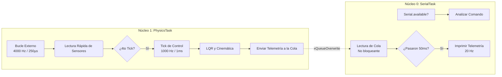
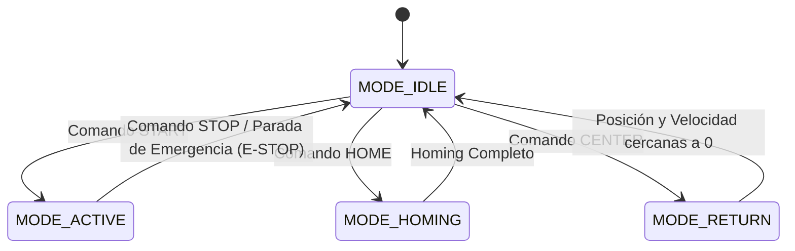
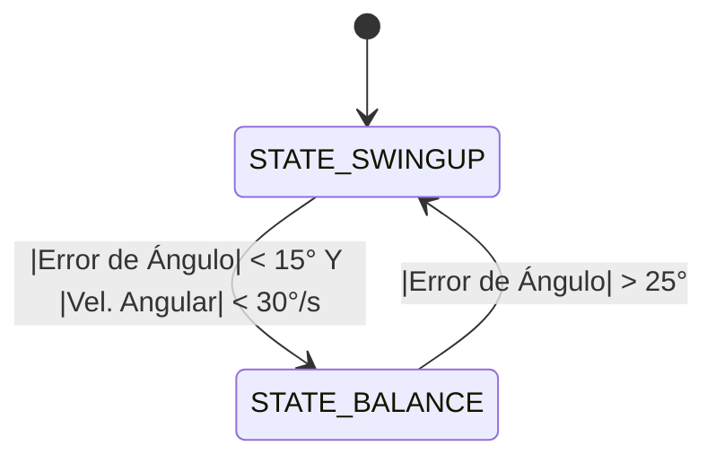

# Péndulo Doble Invertido - Documentación del Proyecto

## Tabla de Contenidos
- [Introducción](#introducción)
- [Teoría de Operación](#teoría-de-operación)
  - [Espacio de Estados del Carro-Péndulo y Control LQR](#espacio-de-estados-del-carro-péndulo-y-control-lqr)
  - [Algoritmo de Elevación (Swing-Up) con Adelanto de Fase](#algoritmo-de-elevación-swing-up-con-adelanto-de-fase)
- [Descripción del Problema](#descripción-del-problema)
- [Arquitectura de Software](#arquitectura-de-software)
- [Tablas de Pines (Pinout)](#tablas-de-pines-pinout)
- [Diagramas de Tiempo y Arquitectura FreeRTOS](#diagramas-de-tiempo-y-arquitectura-freertos)
- [Máquinas de Estados](#máquinas-de-estados)
- [Referencia de Comandos por Serie](#referencia-de-comandos-por-serie)
- [Guía de Interfaz API en Python](#guía-de-interfaz-api-en-python)

## Introducción

El Péndulo Doble Invertido es un problema clásico y altamente no lineal de los sistemas de control que sirve como un excelente banco de pruebas para la teoría de control moderno avanzado, el procesamiento integrado en tiempo real y la mecatrónica de precisión. Este proyecto implementa un carro motorizado que se desplaza sobre un riel lineal para equilibrar dinámicamente un péndulo en su posición vertical invertida.

En esencia, este proyecto demuestra la capacidad de un microcontrolador ESP32 para manejar cálculos físicos en tiempo real de alta exigencia (hard real-time) utilizando FreeRTOS, fusión de sensores de alta frecuencia y procesamiento multihilo. El sistema aprovecha el control por retroalimentación de estados (LQR) y un integrador para mantener el equilibrio, mientras utiliza un algoritmo de inyección de energía no lineal para "elevar" (swing up) el péndulo desde su estado de reposo hacia abajo hasta el área de captura.

---

## Teoría de Operación

### Espacio de Estados del Carro-Péndulo y Control LQR

El sistema funciona esencialmente como si se equilibrara un palo de escoba en la palma de la mano, donde el carro motorizado actúa como la mano y el péndulo como la escoba. El objetivo principal es estabilizar un punto de equilibrio extremadamente inestable.

Para controlar el sistema, primero definimos su estado matemático. La dinámica del carro-péndulo se puede describir completamente mediante cuatro **Variables de Estado** dinámicas en un instante dado:

1. **Posición del Carro ($x$)**: La posición absoluta del carro en el riel lineal (metros).
2. **Velocidad del Carro ($v$)**: La velocidad del carro (m/s).
3. **Ángulo del Péndulo ($\theta$)**: La desviación del péndulo respecto al centro vertical (radianes).
4. **Velocidad Angular del Péndulo ($\omega$)**: La velocidad a la que cae el péndulo (rad/s).

Definimos el vector de estado $X$:

$$
X = \begin{bmatrix} x \\ v \\ \theta \\ \omega \end{bmatrix}
$$

Cerca del punto de equilibrio vertical ($\theta \approx 0$), las ecuaciones no lineales de movimiento pueden ser linealizadas en una forma estándar de espacio de estados:

$$
\dot{X} = A X + B u
$$

Donde $A$ es la matriz dinámica del sistema, $B$ es la matriz de entrada y $u$ es nuestra entrada de control (PWM del motor).

**Regulador Cuadrático Lineal (LQR)**

El Regulador Cuadrático Lineal es una estrategia de control óptimo. Calcula la entrada de control óptima $u$ que minimiza una función de costo cuadrática $J$:

$$
J = \int_{0}^{\infty} (X^T Q X + u^T R u) dt
$$

- **Matriz $Q$**: Penaliza los errores de estado (ej. si queremos evitar severamente que el ángulo caiga, aumentamos el peso dentro de $Q$ para el estado $\theta$).
- **Matriz $R$**: Penaliza el esfuerzo de control (ej. si queremos ahorrar energía o evitar que los motores se saturen, aumentamos la penalización en $R$).

Al resolver la Ecuación Algebraica de Riccati fuera de línea, LQR proporciona una matriz óptima de ganancias de retroalimentación $K = [K_x, K_v, K_\theta, K_\omega]$. En el sistema embebido, la ley de control se convierte en una simple suma ponderada. Cuando el péndulo está cerca de la posición vertical, el algoritmo LQR multiplica cada una de estas cuatro variables de estado por ganancias específicas (`Kth`, `Kw`, `Kx`, `Kv`) y las suma para determinar el voltaje exacto del motor (PWM) necesario para contrarrestar la caída:

$$
u = -K X = -(K_x x + K_v v + K_\theta \theta + K_\omega \omega)
$$

**Agregando un Integrador**

Un controlador LQR puro puede sufrir de un error de estado estacionario (ej. deriva) debido a la fricción, dinámicas no modeladas o un riel desnivelado. Para corregir esto, se agrega un estado Integrador al sistema, acumulando el error de posición en el tiempo para forzar que el carro regrese exactamente al centro del riel.

**Implementación en el Código del ESP32**

En el firmware del ESP32, las variables de estado físico se actualizan continuamente utilizando los codificadores (encoders) de los motores y el sensor de ángulo magnético SPI. Durante el modo `STATE_BALANCE`, el algoritmo LQR se aplica directamente. A continuación, se muestra el fragmento de código exacto que demuestra el bucle de retroalimentación LQR y el integrador:

```cpp
else if (sysState.pen_state == STATE_BALANCE) {
  // EL INTEGRADOR: Acumular el error de posición del carro en el tiempo
  x_integral += (x * Config::Hardware::DT);
  x_integral = constrain(x_integral, -Config::LQR::IntLimit, Config::LQR::IntLimit);

  // 1. Calcular los términos individuales de retroalimentación LQR (u = -KX)
  debug_term_theta = Config::LQR::Kth * theta;
  debug_term_w = Config::LQR::Kw * w;
  
  // Para mover el carro hacia el centro, primero debemos inclinar el palo hacia el centro.
  // Para inclinar el palo hacia el centro, debemos acelerar el carro LEJOS del centro.
  // ¡Por lo tanto, Kx, Kv e IntK deben tener un signo OPUESTO a Kth y Kw!
  debug_term_x = -Config::LQR::Kx * x;
  debug_term_v = -Config::LQR::Kv * v;
  debug_term_integral = -Config::LQR::IntK * x_integral;

  // 2. Sumar para obtener la salida de control total
  debug_control = debug_term_theta 
                  + debug_term_w 
                  + debug_term_x 
                  + debug_term_v
                  + debug_term_integral;
```

### Algoritmo de Elevación (Swing-Up) con Adelanto de Fase

El LQR solo es efectivo cerca del punto de equilibrio. Si el péndulo está colgando hacia abajo en reposo, el sistema entra en una **Fase de Elevación (Swing-Up)** utilizando un avanzado **Algoritmo de Inyección de Energía con Adelanto de Fase (Phase-Lead Pump)**:

- **Detección de Cruce por Cero**: El sistema rastrea el ángulo pico máximo de cada oscilación consecutiva.
- **Inyección con Adelanto de Fase**: Al proyectar el ángulo ligeramente hacia el futuro utilizando su velocidad angular, el carro invierte su dirección justo *antes* de que el péndulo cruce el centro. Esto maximiza la transferencia de energía cinética.
- **Atenuación Proporcional**: A medida que el pico de la oscilación se acerca a la parte superior (ej. al superar los 120°), la fuerza de inyección disminuye linealmente. Esto evita que el péndulo sobrepase bruscamente la Zona de Captura.

Una vez que el péndulo entra en la "Zona de Captura" (ej. dentro de los 15° respecto a la vertical), el estabilizador LQR toma el control de manera fluida para capturarlo y estabilizarlo.

---

## Descripción del Problema

El objetivo de control fundamental es doble:
1. **Fase de Elevación (Swing-Up)**: Inyectar energía cinética al péndulo en reposo moviendo el carro hacia adelante y hacia atrás hasta que el eslabón alcance un umbral angular crítico (a menos de 15° de la vertical).
2. **Fase de Equilibrio**: Capturar y estabilizar el punto de equilibrio vertical altamente inestable utilizando un bucle de retroalimentación de múltiples estados mientras se mantiene el carro centrado en el riel.

Esto requiere mantener cuatro variables de estado críticas de forma dinámica:
- Posición ($x$) y Velocidad ($v$) del Carro
- Ángulo ($\theta$) y Velocidad Angular ($\omega$) del Péndulo

Los principales desafíos de ingeniería resueltos dentro de este código base incluyen:
- **Restricciones de Tiempo Real**: Ejecutar un bucle de control determinista a 1000 Hz y un bucle de lectura de sensores a 4000 Hz utilizando tareas ancladas de FreeRTOS.
- **Imperfecciones del Hardware**: Superar la fricción estática del motor (stiction), compensar la fuerza contraelectromotriz (back-EMF) y suavizar el ruido del sensor utilizando derivadas de diferencias finitas a prueba de desbordamiento (wrap-safe).
- **Restricciones de Seguridad**: Implementar límites de riel por software (ej. detener el carro si viaja más allá de $\pm0.4$m) y búsqueda de origen (homing) mediante interruptores de límite de hardware.

---

## Arquitectura de Software

La última revisión del código base ha mejorado drásticamente la arquitectura de software para facilitar su mantenimiento y escalabilidad:
- **`Config.h` / `Config.cpp`**: Todos los pines de hardware, restricciones cinemáticas, ganancias LQR predeterminadas y parámetros de ajuste de las máquinas de estados se han centralizado en un espacio de nombres `Config::`. Esto elimina los "números mágicos" del programa principal.
- **Objeto `SystemState`**: Las variables globales en tiempo de ejecución (como el modo de operación actual, los disparadores de pruebas y las compensaciones) se han encapsulado limpiamente dentro de un objeto centralizado `sysState`.

---

## Tablas de Pines (Pinout)

### Buses de Comunicación

| Bus / Interfaz | Señal | Pin GPIO | Notas |
|-----------------|--------|----------|-------|
| **I2C (MT6701)** | SDA | 13 | |
| | SCL | 12 | |
| **SPI** | MOSI | 10 | Compartido por MT6816 e ICM45686 |
| | MISO | 8 | |
| | SCK | 11 | |
| | CS (MT6816) | 9 | Sensor de Ángulo |
| | CS (ICM45686)| -1 | Deshabilitado en el código |

### Control de Motores (BTS7960)

| Señal | Pin GPIO | Notas |
|--------|----------|-------|
| RPWM (Adelante) | 2 | Canal LEDC 0 |
| LPWM (Reversa) | 3 | Canal LEDC 1 |
| R_EN | -1 | Conectado a HIGH por defecto |
| L_EN | -1 | Conectado a HIGH por defecto |
| R_IS | -1 | Sensor de corriente no conectado |
| L_IS | -1 | Sensor de corriente no conectado |

### Codificadores (Encoders) y E/S

| Señal | Pin GPIO | Notas |
|--------|----------|-------|
| Motor Encoder A | 5 | PCNT_UNIT_0 |
| Motor Encoder B | 6 | PCNT_UNIT_0 |
| Interruptor de Inicio (Home) | 15 | Activo en LOW (INPUT_PULLUP) |

---

## Diagramas de Tiempo y Arquitectura FreeRTOS

El sistema utiliza la arquitectura de doble núcleo del ESP32, dividiendo las tareas entre el Núcleo 0 y el Núcleo 1.



> [!NOTE] 
> **Núcleo 1 (`PhysicsTask`)**: Bucle de control en tiempo real estricto (hard real-time). 
> - **Bucle Externo a 4000 Hz (250 µs)**: Lectura rápida de sensores y acumulación de ángulos.
> - **Tick de Control a 1000 Hz (1000 µs)**: Se ejecuta cada cuarto tick del bucle externo. Calcula el seguimiento de estados, el filtrado de errores, el control LQR y la salida PWM, para luego enviar la telemetría a una cola de FreeRTOS.
>
> **Núcleo 0 (`SerialTask`)**: 
> - Lectura no bloqueante de colas para telemetría.
> - El intervalo de impresión de telemetría en serie es de 50 ms.
> - Análisis asincrónico de comandos en serie.

---

## Máquinas de Estados

La lógica consiste en una máquina de estados de alto nivel para el **Modo del Sistema (System Mode)** y una máquina de estados anidada para el **Estado del Péndulo (Pendulum State)**, utilizada durante el equilibrio activo.

### 1. Máquina de Estados del Modo del Sistema

Dicta el modo de funcionamiento general del sistema carro-péndulo.



- **`MODE_IDLE` (Inactivo)**: Motores detenidos. La salida PWM es 0. El sistema espera comandos.
- **`MODE_ACTIVE` (Activo)**: El bucle de control del péndulo está en ejecución (utilizando la Máquina de Estados del Péndulo).
- **`MODE_HOMING` (Inicio)**: El carro busca el interruptor de límite para calibrar su posición absoluta en el riel.
- **`MODE_RETURN` (Retorno)**: El carro regresa a la posición central (posición 0, velocidad 0) utilizando control PD.

### 2. Máquina de Estados del Péndulo (Modo Activo)

Cuando el sistema está en `MODE_ACTIVE`, esta máquina de estados gestiona la lógica de elevación (swing-up) y equilibrio.



- **`STATE_SWINGUP` (Elevación)**: El controlador de inyección de energía se activa para elevar el péndulo. Un parámetro de elevación automática opcional puede alternar entre el algoritmo de inyección de energía y un simple arrastre hacia el centro.
- **`STATE_BALANCE` (Equilibrio)**: Se activa el control de retroalimentación de estado completo LQR + Integrador para equilibrar el péndulo y mantener el carro centrado. Se aplican límites de riel para evitar colisiones.

> El umbral para capturar el péndulo es de 15° con una velocidad angular inferior a 30°/s. Volverá al modo de elevación si el ángulo supera los 25° con respecto a la vertical.

---

## Referencia de Comandos por Serie

El ESP32 escucha en el puerto serie (1.000.000 baudios) los comandos para cambiar de estado y ajustar parámetros sobre la marcha. Los comandos deben terminar con un salto de línea (`\n`).

### Modos del Sistema
- `START`: Entra en `MODE_ACTIVE` (Elevación y Equilibrio).
- `STOP`: Entra en `MODE_IDLE` (Detiene los motores inmediatamente).
- `HOME`: Entra en `MODE_HOMING` (Busca el interruptor de límite).
- `CENTER`: Entra en `MODE_RETURN` (Mueve el carro al centro del riel; debe estar en `IDLE`).
- `ZERO`: Pone a cero los valores de los sensores (debe estar en `IDLE`).

### Calibración y Ajustes
- `MOTOR <A_ff> <C_ff>`: Actualiza la compensación de la fuerza contraelectromotriz del motor (`A_ff`) y la fricción estática (`C_ff`).
- `FLIP`: Invierte el signo de dirección del motor.
- `GAINS <Kth> <Kw> <Kx> <Kv>`: Actualiza las ganancias de retroalimentación de estado del LQR para el Ángulo del Péndulo, la Velocidad Angular del Péndulo, la Posición del Carro y la Velocidad del Carro.
- `PUMP <K>`: Actualiza la ganancia de inyección de energía para la fase de elevación.
- `RAIL <m>`: Actualiza los límites del riel por software en metros (ej. `0.4`).
- `CATCH <deg/s>`: Establece el umbral de velocidad angular para la transición al modo de equilibrio.
- `SWINGUP <1|0>`: Habilita (`1`) o deshabilita (`0`) el modo de elevación automática.

### Pruebas de Hardware (Requiere modo IDLE)
- `RAW <pwm>`: Aplica un valor de PWM crudo (de -255 a 255). Envíe `STOP` para detener.
- `VELTEST <pwm> <duration_ms>`: Aplica un valor PWM durante una duración específica en milisegundos.
- `STATUS`: Imprime la configuración y ganancias actuales.

---

## Guía de Interfaz API en Python

Para comunicarse con el Péndulo Doble Invertido desde un script en Python, puede utilizar la biblioteca `pyserial` para enviar comandos y analizar el flujo de telemetría entrante a 20 Hz.

### 1. Conexión al Puerto Serie
Asegúrese de que la velocidad en baudios coincida con la del ESP32 (`1000000` baudios).

```python
import serial
import time

# Reemplace 'COM3' o '/dev/ttyUSB0' por su puerto real
esp32 = serial.Serial('COM3', baudrate=1000000, timeout=1)
time.sleep(2) # Espera a que el ESP32 se reinicie tras conectarse
```

### 2. Envío de Comandos
Los comandos deben tener formato de cadena de texto (string) y codificarse a bytes.

```python
def send_command(cmd_string):
    full_cmd = f"{cmd_string}\n"
    esp32.write(full_cmd.encode('utf-8'))
    esp32.flush()

# Ejemplos:
send_command("GAINS 500.0 0.0 0.0 0.0")
send_command("START")
```

### 3. Análisis de Datos de Telemetría
El ESP32 transmite una cadena de telemetría separada por comas cada 50ms (20 Hz). 
La estructura del paquete es:
`timestamp, mode, enc_ticks, cart_pos, cart_vel, arm1_angle, pos_error, target_vel, pwm_out, term_theta, term_w, term_x, term_v, term_integral`

```python
def read_telemetry():
    if esp32.in_waiting > 0:
        line = esp32.readline().decode('utf-8').strip()
        
        # Ignorar registros de inicio o ecos de comandos
        if not line or line.startswith(">>") or line.startswith("="):
            return None
            
        data = line.split(',')
        if len(data) == 14:
            telemetry = {
                "timestamp_us": int(data[0]),
                "mode": int(data[1]),
                "enc_ticks": int(data[2]),
                "cart_pos_m": float(data[3]),
                "cart_vel_ms": float(data[4]),
                "arm1_angle_deg": float(data[5]),
                "pos_error": float(data[6]),
                "target_vel": float(data[7]),
                "pwm_out": float(data[8]),
                "term_theta": float(data[9]),
                "term_w": float(data[10]),
                "term_x": float(data[11]),
                "term_v": float(data[12]),
                "term_integral": float(data[13])
            }
            return telemetry
    return None
```
